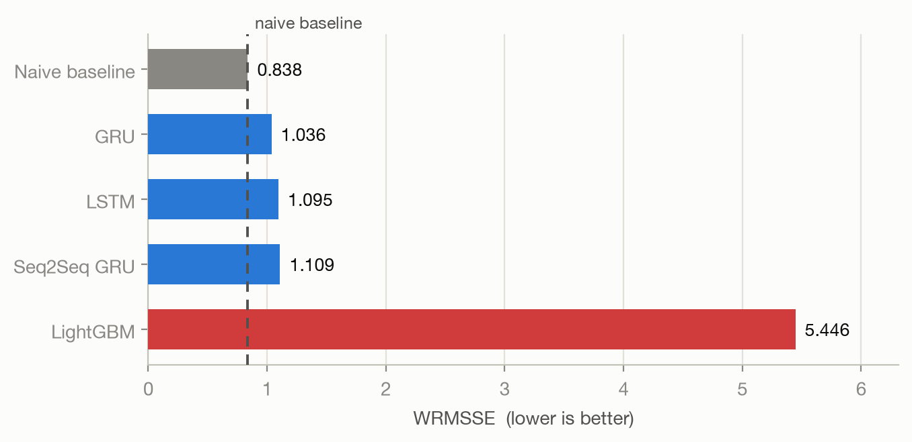
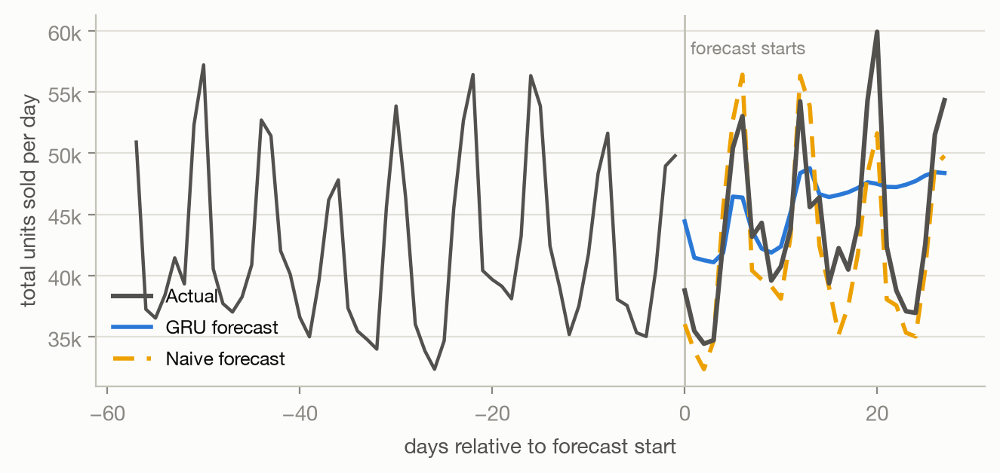
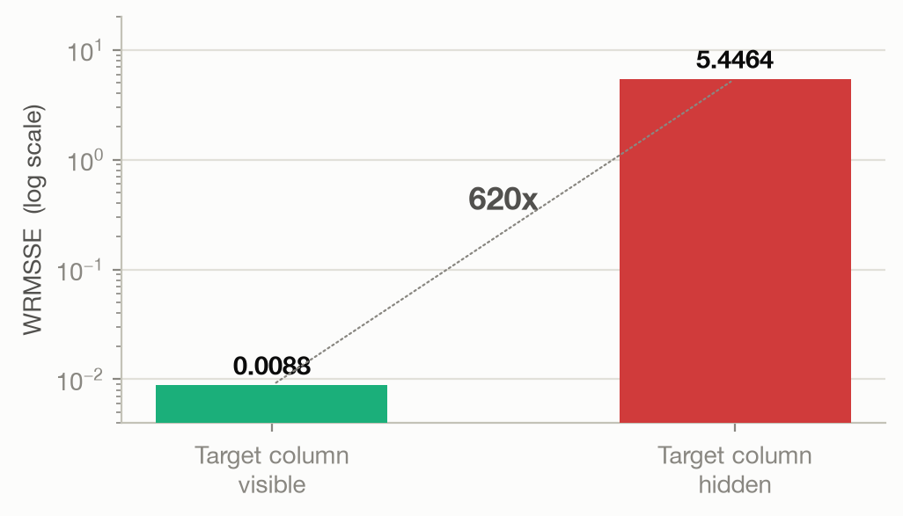

# Walmart Demand Forecasting

This project forecasts daily product demand across Walmart stores over a 28-day horizon,
using the Kaggle [M5](https://www.kaggle.com/competitions/m5-forecasting-accuracy) sales,
pricing and calendar data. Four approaches are compared against the competition's own
weighted metric: LightGBM, LSTM/GRU, Seq2Seq GRU and a naive baseline.

3,049 products × 10 stores = 30,490 series. Jan 2011 to Apr 2016. 68% of item-days are zero.

---

## Project Structure

| File | Description |
|------|-------------|
| `src/prep.py` | Wide sales table to long table, joined with calendar and prices |
| `src/features.py` | Lag, rolling, calendar and price features |
| `src/lgbm.py` | LightGBM, one model per store per week |
| `src/rnn.py` | LSTM and GRU sequence models on rolling windows |
| `src/seq2seq.py` | Encoder-decoder GRU, all 28 days in one shot |
| `src/wrmsse.py` | The competition metric, all 12 aggregation levels |
| `src/figures.py` | Generates the charts below |
| `reports/writeup.pdf` | Full write-up: method, results and what went wrong |
| `reports/deck.pdf` | Presentation slides |

---

## Data Source

The Kaggle download is about 430 MB, so none of it is committed here. Grab
`calendar.csv`, `sell_prices.csv`, `sales_train_validation.csv` and
`sales_train_evaluation.csv` from the
[competition data page](https://www.kaggle.com/competitions/m5-forecasting-accuracy/data)
and unzip them into `m5-forecasting-accuracy/`. Everything under `data/` and `models/` is
rebuilt from those by the scripts below.

---

## Running It

```bash
pip install -r requirements.txt

python -m src.prep        # ~20 s
python -m src.features    # ~60 s
python -m src.lgbm        # ~20 min
python -m src.rnn         # ~13 min
python -m src.seq2seq     # ~5 min
```

---

## Objectives

- Produce a 28-day forecast for every one of the 30,490 item-store series
- Compare gradient boosting against sequence models on the same data and metric
- Measure every model against a naive baseline, not just against each other
- Score at all 12 aggregation levels, since store-item and national totals behave differently

---

## Models Explored

### Naive Baseline
- Repeats the last 28 days forward
- No training and no features. The bar every other model has to clear

### LightGBM
- Fast and interpretable, one model per store per week
- Extensive feature engineering: lags, rolling windows, price dynamics, calendar

### LSTM and GRU
- Sequence models on rolling input windows
- Predictions fed back in step by step across the horizon

### Seq2Seq GRU
- One-shot 28-day forecast with no feedback loop
- Lightweight and fast to train, but works from fewer features

---

## Key Findings

- **No model beat the naive baseline.** The best of them is 24% worse than simply
  repeating last month's sales.
- Sales follow a weekly cycle that the naive forecast copies for free. The GRU flattens
  toward the average. It gets the level right and loses the shape, because each prediction
  is fed back in as input, so errors compound across the horizon.
- The ranking flips by aggregation level. Naive dominates at aggregate levels (total:
  0.63 vs GRU 1.00), but **the GRU beats naive at the finest level** (store-item: 0.886
  vs 1.157). The models are not useless. They lose at the levels WRMSSE weights heavily.
- LightGBM's first score of 0.0088 was impossible. It was a data leak, not a result. See
  below.

---

## Results

Scored with WRMSSE on days 1914 to 1941. Lower is better.



| Model | WRMSSE |
|-------|--------|
| Naive baseline (repeat last 28 days) | **0.8377** |
| GRU | 1.0365 |
| LSTM | 1.0953 |
| Seq2Seq GRU | 1.1095 |
| LightGBM | 5.4464 |

### Why the forecast goes flat



The naive forecast copies the weekly cycle. The GRU gets the level right and loses the
shape, because its own predictions become its next inputs and the signal washes out.

### A score that looked too good

LightGBM first scored 0.0088. The target column had ended up in the feature set, so the
model was reading sales instead of predicting them.



Same model, same 28 days. The only difference is whether the answer was in the input.
That one column accounted for 78% of the model's gain. The switch is still in the code
(`features.feature_list(leak=...)`) so the effect can be measured rather than described.

---

## Next Steps

- Train past 5 epochs. The loss was still falling
- Give the network the day of the week. It is never told
- Predict all 28 days at once instead of feeding predictions back in
- Use a chronological validation split, not Keras' default

---

## Credits

Built on the [M5 Forecasting Accuracy](https://www.kaggle.com/competitions/m5-forecasting-accuracy)
competition dataset, released by Walmart via the University of Nicosia and hosted on Kaggle.

---

## License

MIT License
